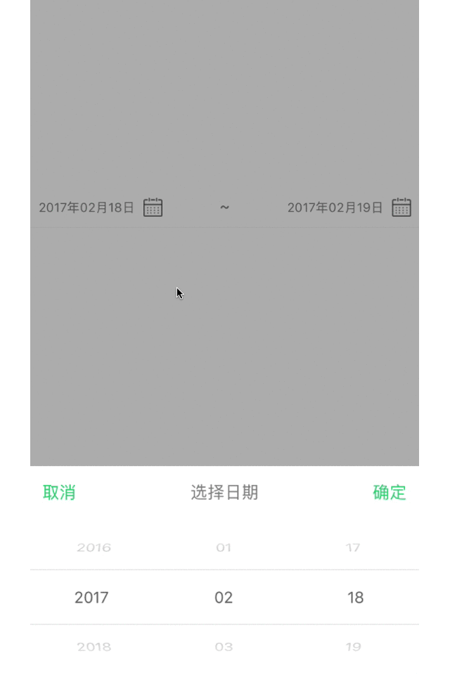

# LXDatePickerView
一款简单日期选择器,使用方便简单.		
    
    LXDateViewPickerView *pickerView = [[LXDateViewPickerView alloc] initWithFrame:CGRectMake(0, 200.f, self.view.width, 40.f)];
    
    pickerView.delegate = self;
    
    [self.view addSubview:pickerView];
		

